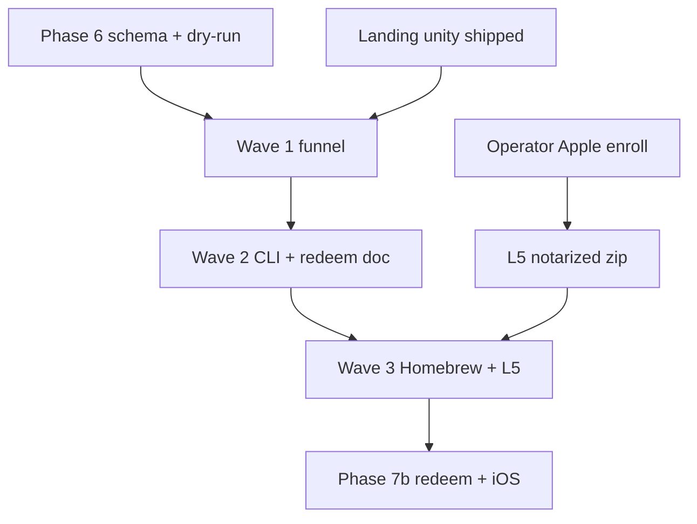

# Phase 7 · absorb traffic · harden ops · finish Mac trust

**Status:** planning (not started) · **Prior ship:** `76b7380` landing unity + LLM/SEO layer  
**Theme:** Turn blog and agent discovery into **alpha installs** · close free-lane build queue (B1–B5) · **L5** notarized Mac installer when operator enrolls Apple.

**Gates (unchanged):** `npm run audit:swarm` · `npm run dry-run:lanes` · `npm run gate:launch` before any prod tag or Stripe policy change.

**Canon:** [`FREE_LANE_SPRINT.md`](./FREE_LANE_SPRINT.md) · [`PHASE_6_FREE_LANE.md`](./PHASE_6_FREE_LANE.md) · [`AI_HANDOFF_ONBOARDING.md`](./AI_HANDOFF_ONBOARDING.md)

---

## Why Phase 7 (after Phase 6 + landing unity)

| Signal | Implication |
|--------|-------------|
| Live smoke **25 ok** · schema + sample on prod | Agents and SEO can cite stable URLs |
| Signed installer **warn/404** | Conversion leaks at Gatekeeper · L5 is the trust capstone |
| Phase 6 B1–B5 still open | Free lane work remains without Apple |
| Landing unity lane green | Next lift is **every blog post** + **funnel metrics**, not home-only |

Phase 7 is **not** a new product lane. It is **distribution + ops depth** on the same post-scare Macintosh triage story.

---

## Objectives (measurable)

| # | Objective | Done when |
|---|-----------|-----------|
| O1 | **Blog → alpha** | Top SEO slugs share one CTA block · **5 queued competitor posts** (`COMPETITOR_ABSORPTION.md`) · `audit-competitor-absorption` green |
| O2 | **Agent routing** | `llms.txt` + ai-bus + FAQ/schema answer “what is Innsegall?” without human support |
| O3 | **CLI agent pipe** | B1: `innsegall check --json` documented · sample in guide + llms |
| O4 | **Seats design** | B2: `docs/REDEEM_SEATS.md` signed · no live redeem until Phase 7b if scoped |
| O5 | **Homebrew unsigned** | B3: tap published or documented blocker · swarm lane when URL live |
| O6 | **Field Report guardrails** | B5: issue_spotlight publish rules · `audit-issue-spotlight` enforced on templates |
| O7 | **Mac trust (L5)** | Operator A1–A4 · `smoke:live` signed line **ok** |

**Explicit non-goals for Phase 7 wave 1:** iOS binary (B4/i1) · AV feature creep · SPQ or cross-product bridges · caretaker/family positioning.

---

## Waves (execution order)

### Wave 1 · Funnel absorption (free · mostly web)

| ID | Build | Owner | Notes |
|----|-------|-------|-------|
| W1a | Blog CTA + lane footer on all posts | web | `sync-blog-cta` policy · post-scare / not antivirus in first screen |
| W1b | JSON-LD on key blog templates (Article + breadcrumb) | web | Match `audit-seo` · no duplicate FAQ on every post |
| W1c | `index` SEO hub stays canonical · posts link back to hub | web | Already started on home · extend audit |
| W1d | Warriors `?ref=` smoke in docs only | ops | No PII in telemetry |

**Exit:** New swarm lanes (see [`PHASE_7_SWARM_PLAN.md`](./PHASE_7_SWARM_PLAN.md)) green · `gate:launch` 0 fail.

### Wave 2 · CLI + docs ops (free)

| ID | Build | Notes |
|----|-------|-------|
| W2a | B1 `check --json` | Guide § agent piping · fixture in `fixtures/` |
| W2b | B2 `REDEEM_SEATS.md` | API shape · fraud · no implementation until wave 2b gate |
| W2c | `dry-run:lanes` row for JSON export | Self-test exports valid against public schema |

**Exit:** `audit-ai-handoff` + guide anchors · `dry-run:lanes` exit 0.

### Wave 3 · Distribution (free + operator)

| ID | Build | Notes |
|----|-------|-------|
| W3a | B3 Homebrew tap | `packaging/homebrew/` · HOMEBREW.md · swarm when `brew install` works |
| W3b | B5 issue spotlight | Template + audit guardrails before any auto-publish script |
| W3c | **L5** Apple | [`APPLE_DEVELOPER_ID.md`](./APPLE_DEVELOPER_ID.md) · release workflow · GitHub asset |

**Exit:** Signed installer **ok** on live smoke · `/alpha` download primary path verified on clean Mac.

### Wave 4 · Optional (Phase 7b)

| ID | Build | Gate |
|----|-------|------|
| W4a | `/api/redeem` implementation | REDEEM_SEATS approved · abuse lane extended |
| W4b | iOS i1 scaffold (separate repo) | Mac L5 green |
| W4c | Seat tokens in license API | Stripe + legal review |

Defer W4 until waves 1–3 exit criteria met.

---

## Dependencies

---

## Operator checklist (parallel to waves)

| Item | Doc |
|------|-----|
| Apple Developer ID + notary | `APPLE_DEVELOPER_ID.md` |
| GitHub Release asset | `DISTRIBUTION_PLAYBOOK.md` |
| Stripe live already probed green | `STRIPE_LIVE_FLIP.md` · one real purchase log |
| Xano telemetry 202 | `diagnose:xano` after env changes |

---

## Success metrics (honest alpha)

| Metric | Tool | Target (directional) |
|--------|------|----------------------|
| Live routes | `smoke:live` | 0 fail · signed ok when L5 done |
| Swarm | `audit:swarm` | 0 lane fail |
| Blog internal links | future `audit-blog-funnel` | 0 broken `/alpha` |
| Telemetry | Xano aggregates | `marketing_ping` · install events up · **no** scout bodies |

---

## Related

- Swarm expansion (planned, **not executed**): [`PHASE_7_SWARM_PLAN.md`](./PHASE_7_SWARM_PLAN.md)
- Meta-review of this plan: [`PHASE_7_PLAN_AUDIT.md`](./PHASE_7_PLAN_AUDIT.md)

*Innsegall only · separate entity and Stripe from other products.*
