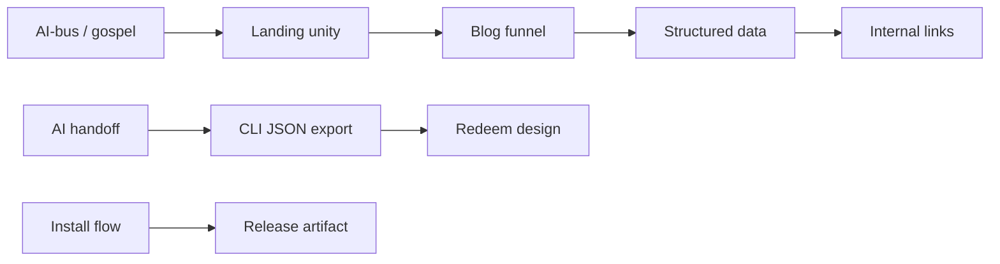

# Phase 7 · swarm plan (rough · do not execute yet)

**Purpose:** Define audit lanes and script changes **before** implementation so Phase 7 waves do not regress gospel, lane, or privacy positioning.

**Rule:** No new lane ships until paired with docs + `audit-swarm.mjs` registration in the **same** merge as the feature (same pattern as `audit-landing-unity.mjs` in Phase 6).

**Do not run** the one-off commands in § “Bootstrap commands” until Wave 1 kickoff commit.

---

## Current swarm (baseline · 17 lanes + engine + visual)

From `scripts/audit-swarm.mjs`:

1. Launch / automation  
2. SEO / discoverability  
3. Social previews  
4. AI-bus / gospel  
5. AI handoff / triage paste  
6. Landing unity · SEO + LLM  
7. Brand lexicon  
8. Abuse / credits  
9. Privacy / local-first  
10. Stripe / checkout  
11. Claymore / voice  
12. Shell / nav / footer  
13. Competitor / lane  
14. Internal links  
15. Issue spotlight loop  
16. Discovery / trust  
17. Install / bootstrap flow  

Plus: engine smoke · self-test · visual checklist.

---

## Proposed new lanes (Phase 7)

| Lane | Script (new) | Target score | Wave | Checks (summary) |
|------|----------------|-------------|------|------------------|
| **Blog funnel** | `audit-blog-funnel.mjs` | 9.5 | W1 | Every `web/blog/*.html` (except index): canonical · `/alpha` CTA · lane phrase · no banned lexicon · links to hub slugs |
| **Structured data** | `audit-structured-data.mjs` | 9.0 | W1 | Home FAQ JSON-LD valid keys · blog Article where template marks `data-structured=article` · no duplicate `@type` conflicts |
| **Gospel coverage** | `audit-gospel-coverage.mjs` | 9.5 | W1 | All `KEY_PAGES` + blog index + stability · `INNSEGALL_AI_BUS_START` · `window.__INNSEGALL_AI_BUS` |
| **CLI JSON export** | `audit-check-json.mjs` | 9.0 | W2 | Guide mentions `--json` · llms one-liner · optional: spawn `innsegall check` in self-test support dir |
| **Redeem design** | `audit-redeem-design.mjs` | 9.5 | W2 | `REDEEM_SEATS.md` exists · no orphan `/api/redeem` in vercel until impl flag |
| **Homebrew surface** | `audit-homebrew.mjs` | 9.0 | W3 | `packaging/homebrew/innsegall.rb` version matches `package.json` · doc link from `/alpha` |
| **Release artifact** | `audit-macos-release.mjs` | 9.5 | W3/L5 | When `INNSEGALL_REQUIRE_SIGNED_INSTALLER=1`: fail if smoke would warn · else warn-only (current behavior) |

---

## Extensions to existing lanes (no new files)

| Lane | Change |
|------|--------|
| `audit-landing-unity.mjs` | Add loop over **all** blog HTML files for ai-bus optional (blog may inherit from sync-blog-chrome only) · CTA + lane phrase per post |
| `audit-seo.mjs` | Require `og:url` on blog posts · max title length |
| `audit-links.mjs` | Add `PAGE_ROUTES` entries as redeem lands · `/samples/battle-scout-ai-v1.sample.json` if linked from HTML |
| `audit-lane.mjs` | Keep `read-only triage` echo · add llms `landing.summary_human` substring check |
| `audit-ai-handoff.mjs` | Assert public schema URL in gospel + llms |
| `audit-discovery.mjs` | `PHASE_7_PLAN.md` linked from `FREE_LANE_SPRINT` “Next phase” |
| `audit-swarm.mjs` visual | Blog funnel sample in visual checklist |

---

## Lane dependency graph (swarm order)



Register new lanes **after** their upstream lanes in `audit-swarm.mjs` only when scripts exist (avoid FAIL spam during development).

---

## Bootstrap commands (future · not now)

```bash
# Wave 1 kickoff only
touch scripts/audit-blog-funnel.mjs scripts/audit-structured-data.mjs scripts/audit-gospel-coverage.mjs
# Implement checks · then append to audit-swarm.mjs lanes array
npm run audit:swarm
```

```bash
# Wave 2
touch scripts/audit-check-json.mjs scripts/audit-redeem-design.mjs
```

```bash
# Wave 3
touch scripts/audit-homebrew.mjs scripts/audit-macos-release.mjs
# Operator: INNSEGALL_REQUIRE_SIGNED_INSTALLER=1 npm run smoke:live
```

---

## CI / package.json (planned)

| Script | Role |
|--------|------|
| `audit:blog-funnel` | Run blog lane alone during content edits |
| `audit:phase7` | Subset: blog + structured + gospel coverage |
| `gate:launch` | Unchanged · signed warn until L5 |

Optional Vercel **ignored** for doc-only commits; any `web/` change still needs `gate:launch`.

---

## Out of scope for swarm expansion

- WeWeb / SPQ canvas audits  
- iOS Xcode build verification (doc-only until i1 repo)  
- Live Stripe charge tests in CI (remain manual per `STRIPE_LIVE_FLIP.md`)  
- Crawling external search rankings (no automated SEO score fantasies)

---

## Rollback

If a new lane blocks merge unnecessarily:

1. Set lane to **warn** mode via env `INNSEGALL_SWARM_WARN=blog-funnel` (not implemented · design for Phase 7 wave 1 if needed).  
2. Or revert lane registration in `audit-swarm.mjs` only · keep script for local use.

---

*Rough plan · execute only after [`PHASE_7_PLAN_AUDIT.md`](./PHASE_7_PLAN_AUDIT.md) gaps are accepted or waived.*
