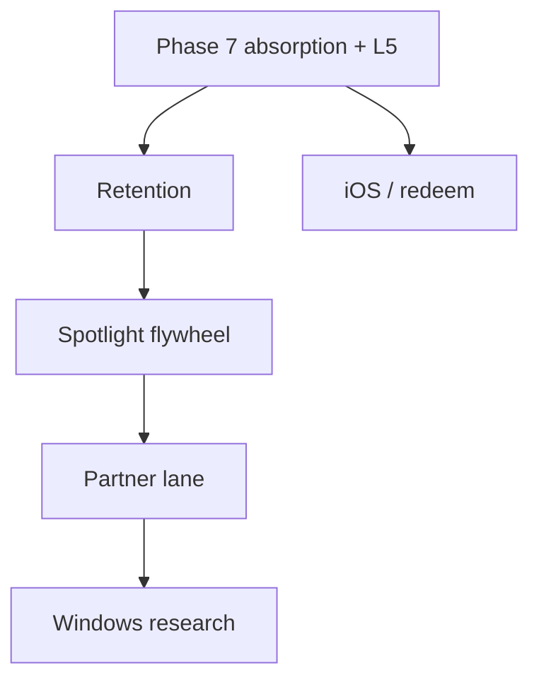

# Phase 8 · scale habit · partner lane · iOS inbox (rough)

**Status:** Wave 1 in progress (operator voice · voyage onboarding · partner/warrior docs) · **Assumes Phase 7 exit:** absorption posts shipped · L5 signed installer **ok** · B1–B5 closed or explicitly waived  
**Theme:** Convert **installed scouts** into **Voyage habit** and **clan/team retention** · open **partner escalation** without becoming AV · **iOS inbox** (spec → scaffold) after Mac trust is boring.

**Gates:** `npm run audit:swarm` · `npm run dry-run:lanes` · `npm run gate:launch` · no new paid SKUs without Stripe + abuse lane update.

**Canon:** [`PHASE_7_PLAN.md`](./PHASE_7_PLAN.md) · [`IOS_PRODUCT.md`](./IOS_PRODUCT.md) · [`FREE_LANE_SPRINT.md`](./FREE_LANE_SPRINT.md)

---

## Why Phase 8 (after Phase 7)

| Signal | Implication |
|--------|-------------|
| SEO + agent routes saturated for post-scare intents | Growth shifts to **retention** and **word-of-mouth** (warriors, clan) |
| Signed Mac install path green | Safe to ask for **habit** (Voyage) without Gatekeeper drop-off |
| Issue spotlight guardrails live | Can automate **trend → Field Report** with less brand risk |
| Redeem/seats doc signed in P7 | P8 can implement **controlled** seat flows if abuse lane extended |

Phase 8 adds **depth and loops** · not a new core lane.

---

## Objectives (directional)

| # | Objective | Done when |
|---|-----------|-----------|
| O1 | **Voyage retention** | Welcome + 1st/15th nudges documented · telemetry `voyage_*` events in Xano paste · chart UX smoke |
| O2 | **Warrior / clan loop** | Ref attribution in telemetry dashboards (ops doc) · clan copy operator-aligned sitewide |
| O3 | **Partner escalation** | `Sound the Horn` / Parley partner criteria doc · no offshore funnel |
| O4 | **Issue spotlight auto** | Semi-auto publish from anonymized aggregates · human approve gate |
| O5 | **iOS i1** | Separate repo scaffold · paste import only · TestFlight criteria doc updated |
| O6 | **Redeem live (optional 8b)** | `/api/redeem` if P7b approved · fraud middleware · swarm abuse extended |
| O7 | **Windows spike (research)** | One-pager: in/out of lane · no binary unless gospel amended |

**Non-goals:** Real-time AV · kernel drivers · enterprise MDM · SPQ bridge · family/caretaker marketing.

---

## Waves (rough order)

### Wave 1 · Retention & copy unity

| ID | Build |
|----|-------|
| W1a | Clan/meta/household → team/seats sweep (`audit-brand` extension or `audit-operator-voice.mjs`) |
| W1b | Voyage onboarding in guide + alpha post-install |
| W1c | Warriors playbook: when to link `?ref=` in Field Reports |

### Wave 2 · Spotlight flywheel

| ID | Build |
|----|-------|
| W2a | Issue spotlight template v2 · `audit-issue-spotlight` stricter |
| W2b | Operator script: aggregate → draft post → manual publish |
| W2c | llms hints auto-append new spotlight slugs on ship |

### Wave 3 · Partner + escalation

| ID | Build |
|----|-------|
| W3a | `docs/PARTNER_ESCALATION.md` · criteria for hands-on help |
| W3b | Parley / Horn copy aligned with partner lane |
| W3c | Boat **endgame** section links partner doc |

### Wave 4 · iOS + optional redeem

| ID | Build | Gate |
|----|-------|------|
| W4a | iOS repo i1 · inbox + paste viewer | Mac L5 green |
| W4b | TestFlight checklist | Apple same account as Mac ID |
| W4c | Redeem API | Abuse + legal sign-off |

### Wave 5 · Research

| ID | Build |
|----|-------|
| W5a | Windows lane one-pager |
| W5b | Check catalog additions only if spotlight data demands |

---

## Dependencies

---

## Success metrics (alpha-honest)

| Metric | Tool |
|--------|------|
| Repeat Voyage runs / install | Xano aggregates · no scout bodies |
| `marketing_ping` + warrior ref | Telemetry |
| Clan churn | Stripe + support tags |
| Swarm | 0 lane fail after each wave |

---

## Related

- Swarm rough: [`PHASE_8_SWARM_PLAN.md`](./PHASE_8_SWARM_PLAN.md)  
- Meta-audit: [`PHASE_8_PLAN_AUDIT.md`](./PHASE_8_PLAN_AUDIT.md)

*Innsegall only · separate entity and Stripe.*
